# Activity 1 —  Diagrams

- [Overview: system architecture](#overview--what-are-we-building) — Diagrams 01–04
- [Part A: bookstore backend](#part-a--build-and-verify-the-bookstore-backend) — Diagrams 05–10
- [Part B: local model preparation](#part-b--prepare-local-qwen-without-bookstore-tools) — Diagrams 11–14
- [Part C: LangChain and manual tool testing](#part-c--tool-contracts-validation-and-manual-tests) — Diagrams 15–19
- [Part D: tool request parsing and safe execution](#part-d--model-requests-a-tool-python-executes-it) — Diagrams 20–24
- [Part E: multi-step local agent](#part-e--build-a-bounded-multi-step-local-agent) — Diagrams 25–30
- [Part F: add reviews tool](#part-f--extend-the-assistant-with-customer-reviews) — Diagrams 31–35
- [Part G: edge cases and debugging](#part-g--edge-cases-and-evidence-based-diagnosis) — Diagrams 36–37
- [Part H: local versus hosted models](#part-h--compare-local-and-hosted-models-same-database) — Diagrams 38–44
- [Part I: evaluation](#part-i--evaluate-tool-calling-agents) — Diagrams 45–54
- [Final synthesis](#final-synthesis) — Diagram 55

## Overview — What are we building?

### Diagram 01 — Learning journey, from Python to agents

The key progression: verify the database first, test tools without an LLM, and only then permit models to *request* tools. Part B prepares the local model before it is connected to tools.

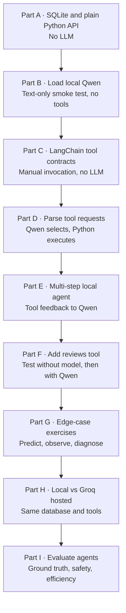
```mermaid
flowchart TD
    A["Part A · SQLite and plain Python API<br/>No LLM"] --> B["Part B · Load local Qwen<br/>Text-only smoke test, no tools"]
    B --> C["Part C · LangChain tool contracts<br/>Manual invocation, no LLM"]
    C --> D["Part D · Parse tool requests<br/>Qwen selects, Python executes"]
    D --> E["Part E · Multi-step local agent<br/>Tool feedback to Qwen"]
    E --> F["Part F · Add reviews tool<br/>Test without model, then with Qwen"]
    F --> G["Part G · Edge-case exercises<br/>Predict, observe, diagnose"]
    G --> H["Part H · Local vs Groq hosted<br/>Same database and tools"]
    H --> I["Part I · Evaluate agents<br/>Ground truth, safety, efficiency"]
```

### Diagram 02 — Big-picture architecture

The local and cloud models both **request** tools. The trusted Python application executes allowlisted tools on its local SQLite database.

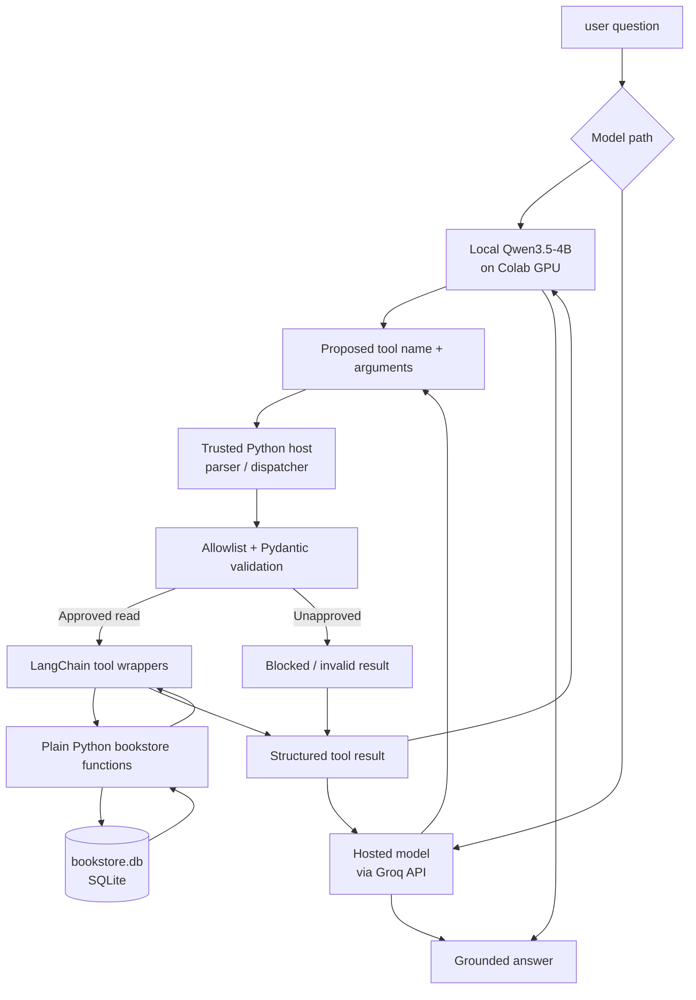
```mermaid
flowchart TB
    USER["user question"] --> ROUTE{"Model path"}
    ROUTE --> LOCAL["Local Qwen3.5-4B<br/>on Colab GPU"]
    ROUTE --> CLOUD["Hosted model<br/>via Groq API"]
    LOCAL --> PROPOSE["Proposed tool name + arguments"]
    CLOUD --> PROPOSE
    PROPOSE --> HOST["Trusted Python host<br/>parser / dispatcher"]
    HOST --> CHECK["Allowlist + Pydantic validation"]
    CHECK -->|"Approved read"| TOOLS["LangChain tool wrappers"]
    TOOLS --> API["Plain Python bookstore functions"]
    API --> DB[("bookstore.db<br/>SQLite")]
    DB --> API
    API --> TOOLS
    TOOLS --> RESULTS["Structured tool result"]
    RESULTS --> LOCAL
    RESULTS --> CLOUD
    LOCAL --> ANSWER["Grounded answer"]
    CLOUD --> ANSWER
    CHECK -->|"Unapproved"| BLOCK["Blocked / invalid result"]
    BLOCK --> RESULTS
```

### Diagram 03 — Three separate responsibilities

You should distinguish the **model** (selects requests), the **application** (validates and executes), and the **database** (stores facts).

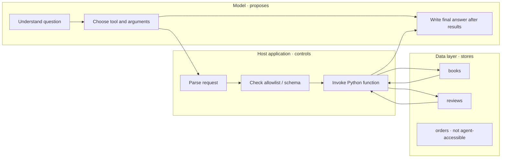
```mermaid
flowchart LR
    subgraph M["Model · proposes"]
        M1["Understand question"] --> M2["Choose tool and arguments"]
        M2 --> M3["Write final answer after results"]
    end
    subgraph H["Host application · controls"]
        H1["Parse request"] --> H2["Check allowlist / schema"]
        H2 --> H3["Invoke Python function"]
    end
    subgraph D["Data layer · stores"]
        D1["books"]
        D2["reviews"]
        D3["orders · not agent-accessible"]
    end
    M2 --> H1
    H3 --> D1
    H3 --> D2
    D1 --> H3
    D2 --> H3
    H3 --> M3
```

### Diagram 04 — What the model sees versus what Python controls

Tool descriptions and schemas are *instructions for requesting a call*, not permission to run arbitrary code.

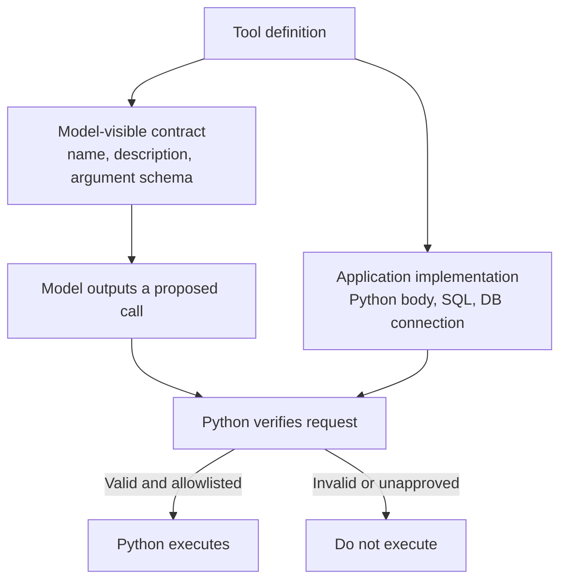
```mermaid
flowchart TD
    DEF["Tool definition"] --> VISIBLE["Model-visible contract<br/>name, description, argument schema"]
    DEF --> PRIVATE["Application implementation<br/>Python body, SQL, DB connection"]
    VISIBLE --> SUGGEST["Model outputs a proposed call"]
    SUGGEST --> GATE["Python verifies request"]
    PRIVATE --> GATE
    GATE -->|"Valid and allowlisted"| RUN["Python executes"]
    GATE -->|"Invalid or unapproved"| REJECT["Do not execute"]
```

## Part A — Build and verify the bookstore backend

### Diagram 05 — SQLite entity relationships

One book may have many reviews and orders. In the later agent parts, only the **books** and **reviews** information is exposed through read-only tools.

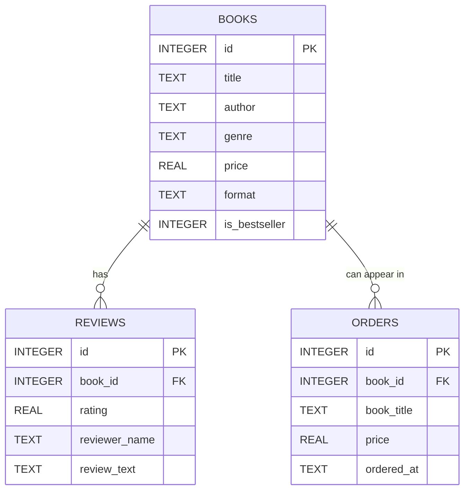
```mermaid
erDiagram
    BOOKS ||--o{ REVIEWS : "has"
    BOOKS ||--o{ ORDERS : "can appear in"
    BOOKS {
        INTEGER id PK
        TEXT title
        TEXT author
        TEXT genre
        REAL price
        TEXT format
        INTEGER is_bestseller
    }
    REVIEWS {
        INTEGER id PK
        INTEGER book_id FK
        REAL rating
        TEXT reviewer_name
        TEXT review_text
    }
    ORDERS {
        INTEGER id PK
        INTEGER book_id FK
        TEXT book_title
        REAL price
        TEXT ordered_at
    }
```

### Diagram 06 — Database creation, seed data and reset behavior

Part A creates 20 books and 25 reviews. Ordinary reruns preserve existing data; an explicit reset deletes the database and its orders.

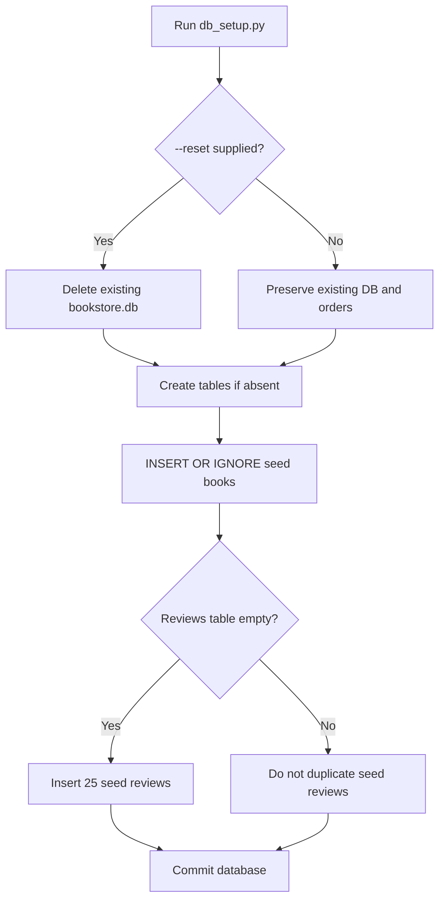
```mermaid
flowchart TD
    S["Run db_setup.py"] --> RESET{"--reset supplied?"}
    RESET -->|"Yes"| DEL["Delete existing bookstore.db"]
    RESET -->|"No"| KEEP["Preserve existing DB and orders"]
    DEL --> SCHEMA["Create tables if absent"]
    KEEP --> SCHEMA
    SCHEMA --> BOOKS["INSERT OR IGNORE seed books"]
    BOOKS --> REV{"Reviews table empty?"}
    REV -->|"Yes"| SEED["Insert 25 seed reviews"]
    REV -->|"No"| SKIP["Do not duplicate seed reviews"]
    SEED --> DONE["Commit database"]
    SKIP --> DONE
```

### Diagram 07 — Plain Python API before any model

These are normal functions called directly by Python in Part A. The order function can write to the database, so checks and later agent registries avoid calling it.

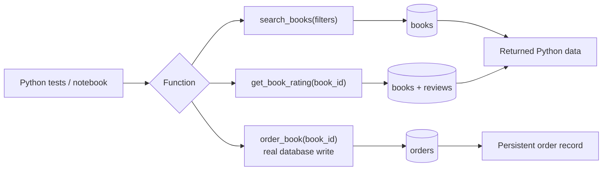
```mermaid
flowchart LR
    CODE["Python tests / notebook"] --> SEL{"Function"}
    SEL --> READ1["search_books(filters)"]
    SEL --> READ2["get_book_rating(book_id)"]
    SEL --> WRITE["order_book(book_id)<br/>real database write"]
    READ1 --> BOOKS[("books")]
    READ2 --> JOIN[("books + reviews")]
    WRITE --> ORDERS[("orders")]
    BOOKS --> OUT["Returned Python data"]
    JOIN --> OUT
    ORDERS --> CONF["Persistent order record"]
```

### Diagram 08 — Parameterized catalog search

Optional filters are assembled into a parameterized `SELECT`; the programmer supplies the SQL structure, and user values are passed separately as parameters.

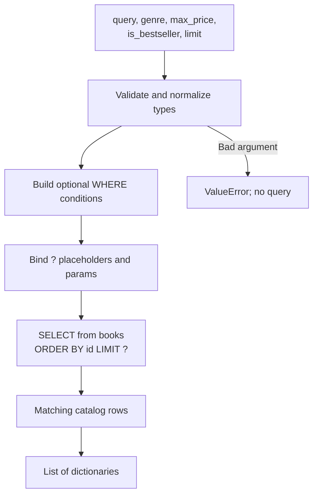
```mermaid
flowchart TD
    IN["query, genre, max_price,<br/>is_bestseller, limit"] --> VALID["Validate and normalize types"]
    VALID --> FILTER["Build optional WHERE conditions"]
    FILTER --> PARAM["Bind ? placeholders and params"]
    PARAM --> SQL["SELECT from books<br/>ORDER BY id LIMIT ?"]
    SQL --> ROWS["Matching catalog rows"]
    ROWS --> DICT["List of dictionaries"]
    VALID -->|"Bad argument"| ERR["ValueError; no query"]
```

### Diagram 09 — Catalog results and independent rating lookup

`search_books` does **not** return review ratings. You must combine search and rating information when a prompt includes both price and rating constraints.

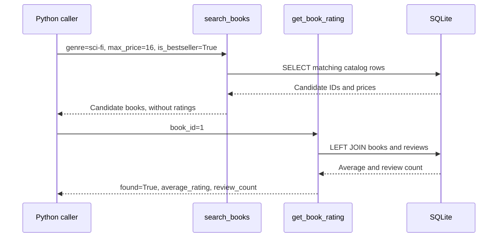
```mermaid
sequenceDiagram
    participant P as Python caller
    participant Search as search_books
    participant Rating as get_book_rating
    participant DB as SQLite
    P->>Search: genre=sci-fi, max_price=16, is_bestseller=True
    Search->>DB: SELECT matching catalog rows
    DB-->>Search: Candidate IDs and prices
    Search-->>P: Candidate books, without ratings
    P->>Rating: book_id=1
    Rating->>DB: LEFT JOIN books and reviews
    DB-->>Rating: Average and review count
    Rating-->>P: found=True, average_rating, review_count
```

### Diagram 10 — Missing book versus existing unrated book

`average_rating=None` alone does not show whether the book exists; the `found` field makes this distinction explicit.

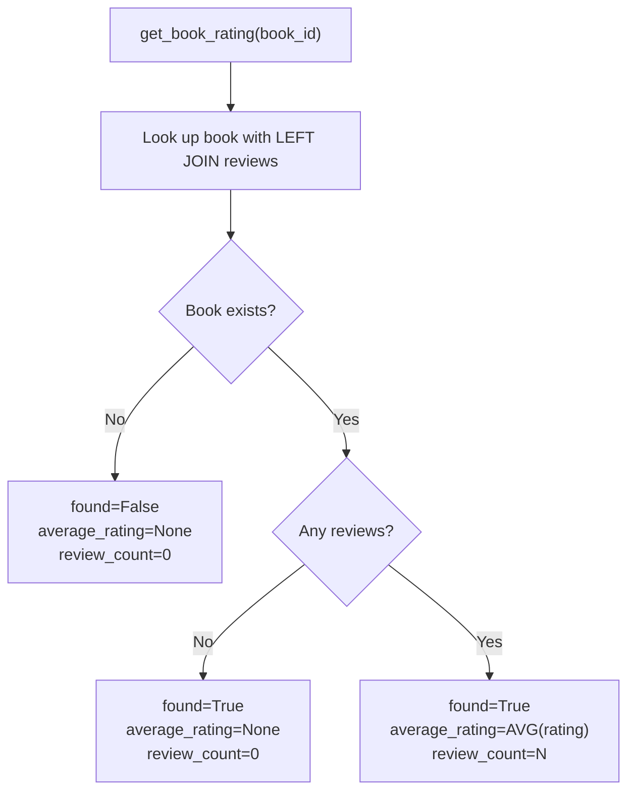
```mermaid
flowchart TD
    START["get_book_rating(book_id)"] --> LOOK["Look up book with LEFT JOIN reviews"]
    LOOK --> EXISTS{"Book exists?"}
    EXISTS -->|"No"| MISSING["found=False<br/>average_rating=None<br/>review_count=0"]
    EXISTS -->|"Yes"| HAS{"Any reviews?"}
    HAS -->|"No"| UNRATED["found=True<br/>average_rating=None<br/>review_count=0"]
    HAS -->|"Yes"| RATED["found=True<br/>average_rating=AVG(rating)<br/>review_count=N"]
```

## Part B — Prepare local Qwen without bookstore tools

### Diagram 11 — Local model preflight and loading

The notebook checks CUDA before loading the multimodal model in 4-bit mode.

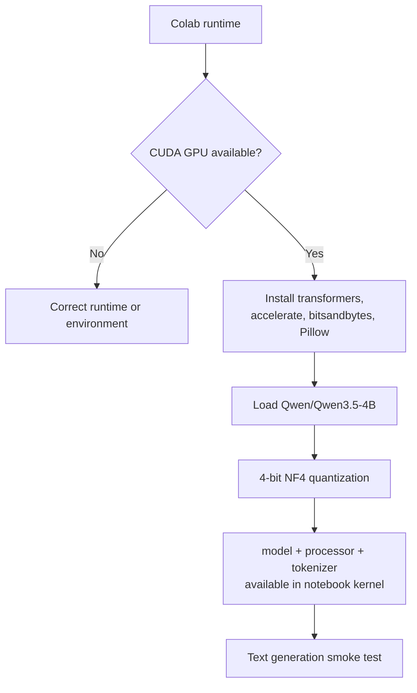
```mermaid
flowchart TD
    START["Colab runtime"] --> GPU{"CUDA GPU available?"}
    GPU -->|"No"| STOP["Correct runtime or environment"]
    GPU -->|"Yes"| PKG["Install transformers,<br/>accelerate, bitsandbytes, Pillow"]
    PKG --> LOAD["Load Qwen/Qwen3.5-4B"]
    LOAD --> Q["4-bit NF4 quantization"]
    Q --> READY["model + processor + tokenizer<br/>available in notebook kernel"]
    READY --> TEST["Text generation smoke test"]
```

### Diagram 12 — Notebook command execution contexts

`%%writefile` saves a script. `!python` executes in a child process; `%run -i` uses the interactive notebook namespace so large model objects remain accessible.

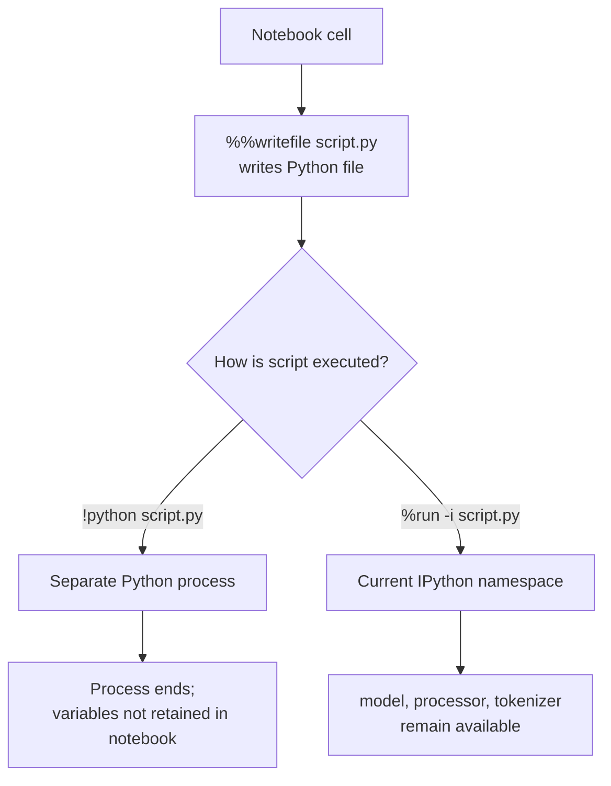
```mermaid
flowchart TD
    CELL["Notebook cell"] --> SAVE["%%writefile script.py<br/>writes Python file"]
    SAVE --> CMD{"How is script executed?"}
    CMD -->|"!python script.py"| CHILD["Separate Python process"]
    CHILD --> DISPOSE["Process ends;<br/>variables not retained in notebook"]
    CMD -->|"%run -i script.py"| KERNEL["Current IPython namespace"]
    KERNEL --> SHARE["model, processor, tokenizer<br/>remain available"]
```

### Diagram 13 — Local inference components

A processor and tokenizer transform inputs; learned weights produce new tokens. Loading a model is separate from exposing tools.

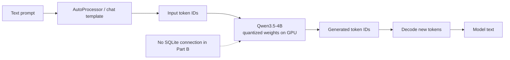
```mermaid
flowchart LR
    PROMPT["Text prompt"] --> PROC["AutoProcessor / chat template"]
    PROC --> TOK["Input token IDs"]
    TOK --> QW["Qwen3.5-4B<br/>quantized weights on GPU"]
    QW --> GEN["Generated token IDs"]
    GEN --> DEC["Decode new tokens"]
    DEC --> TXT["Model text"]
    NOTE["No SQLite connection in Part B"] -.-> QW
```

### Diagram 14 — Why fluency is not database grounding

In Part B, the model can produce a plausible answer, but it has no means of checking the current inventory.

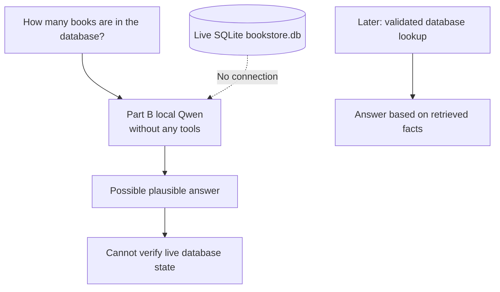
```mermaid
flowchart TD
    Q["How many books are in the database?"] --> LLM["Part B local Qwen<br/>without any tools"]
    LLM --> GUESS["Possible plausible answer"]
    DB[("Live SQLite bookstore.db")] -. "No connection" .-> LLM
    GUESS --> LIMIT["Cannot verify live database state"]
    TOOL["Later: validated database lookup"] --> VERIFIED["Answer based on retrieved facts"]
```

## Part C — Tool contracts, validation and manual tests

### Diagram 15 — Convert Python functions into LangChain tools

`@tool` adds a model-facing contract; it does not rewrite the original SQLite implementation.

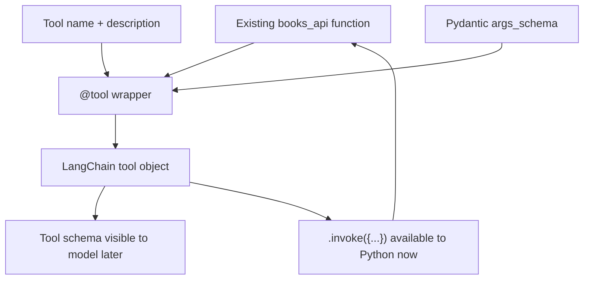
```mermaid
flowchart TD
    FUNC["Existing books_api function"] --> WRAP["@tool wrapper"]
    DOC["Tool name + description"] --> WRAP
    SCHEMA["Pydantic args_schema"] --> WRAP
    WRAP --> OBJECT["LangChain tool object"]
    OBJECT --> EXPOSE["Tool schema visible to model later"]
    OBJECT --> INVOKE[".invoke({...}) available to Python now"]
    INVOKE --> FUNC
```

### Diagram 16 — The tool input contract

A schema specifies accepted field names, types, defaults, and numeric bounds; `extra="forbid"` rejects undeclared fields.

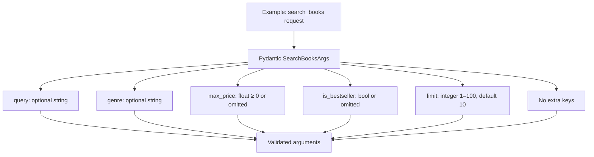
```mermaid
flowchart TB
    REQUEST["Example: search_books request"] --> C["Pydantic SearchBooksArgs"]
    C --> Q["query: optional string"]
    C --> G["genre: optional string"]
    C --> P["max_price: float ≥ 0 or omitted"]
    C --> B["is_bestseller: bool or omitted"]
    C --> L["limit: integer 1–100, default 10"]
    C --> E["No extra keys"]
    Q --> V["Validated arguments"]
    G --> V
    P --> V
    B --> V
    L --> V
    E --> V
```

### Diagram 17 — Manual LangChain invocation, still no LLM

Part C uses `.invoke(...)` directly, proving that tool registration is not the same as agent autonomy.

### Diagram 18 — Type normalization and invalid arguments

The notebook tests string-to-Boolean coercion and rejects values that cannot be safely interpreted.

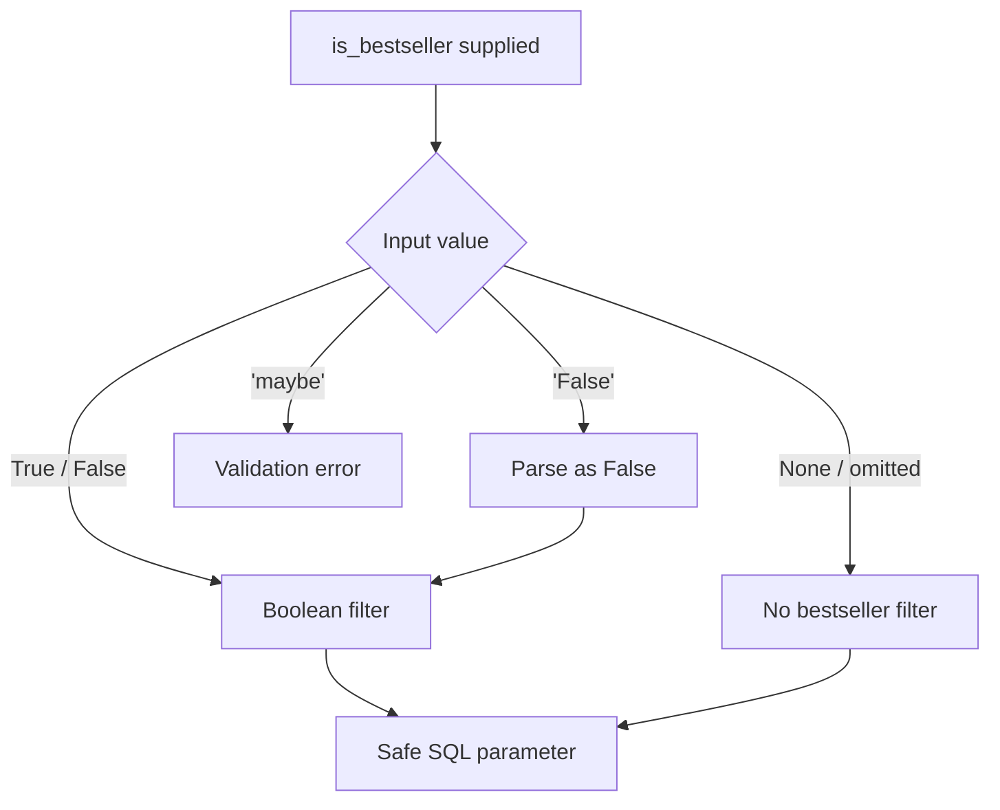
```mermaid
flowchart TD
    INPUT["is_bestseller supplied"] --> TYPE{"Input value"}
    TYPE -->|"True / False"| BOOLEAN["Boolean filter"]
    TYPE -->|"'False'"| CONVERT["Parse as False"]
    TYPE -->|"None / omitted"| ALL["No bestseller filter"]
    TYPE -->|"'maybe'"| FAIL["Validation error"]
    CONVERT --> BOOLEAN
    BOOLEAN --> SQL["Safe SQL parameter"]
    ALL --> SQL
```

### Diagram 19 — Offline functional tests and their limits

Passing Part C tests proves properties of the Python layer, **not** that a model will pick the correct tool.

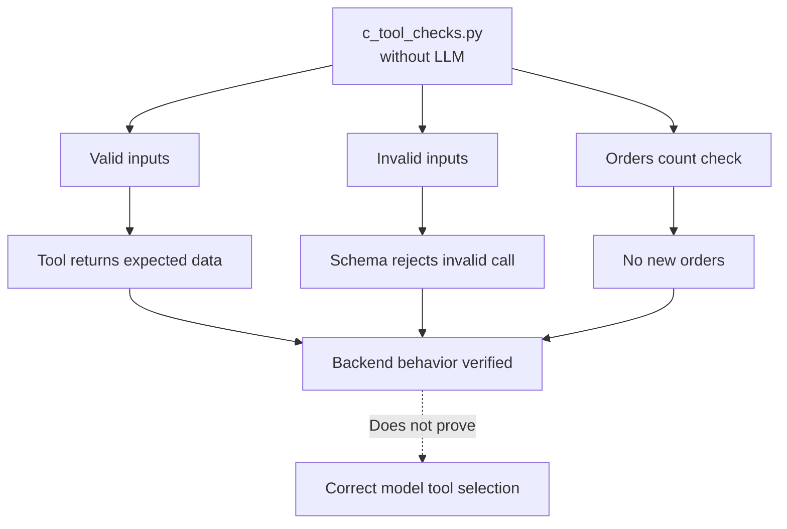
```mermaid
flowchart TD
    CHECKS["c_tool_checks.py<br/>without LLM"] --> GOOD["Valid inputs"]
    CHECKS --> BAD["Invalid inputs"]
    CHECKS --> ORD["Orders count check"]
    GOOD --> PASS["Tool returns expected data"]
    BAD --> REJECT["Schema rejects invalid call"]
    ORD --> SAFE["No new orders"]
    PASS --> CONCLUSION["Backend behavior verified"]
    REJECT --> CONCLUSION
    SAFE --> CONCLUSION
    CONCLUSION -. "Does not prove" .-> MODEL["Correct model tool selection"]
```

## Part D — Model requests a tool; Python executes it

### Diagram 20 — From model output to structured call

Qwen may produce an XML-like request or a JSON payload inside a tool-call block. The parser creates **data**, not executable Python.

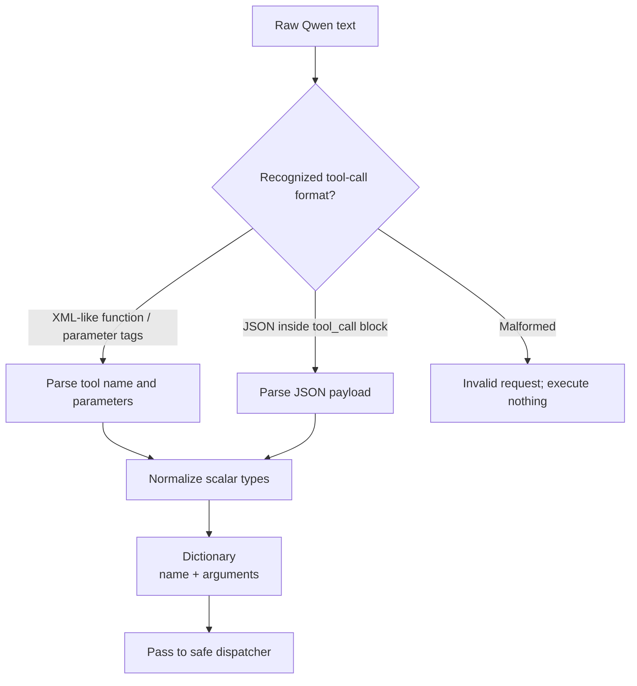
```mermaid
flowchart TD
    RAW["Raw Qwen text"] --> FORMAT{"Recognized tool-call format?"}
    FORMAT -->|"XML-like function / parameter tags"| XML["Parse tool name and parameters"]
    FORMAT -->|"JSON inside tool_call block"| JSON["Parse JSON payload"]
    FORMAT -->|"Malformed"| INVALID["Invalid request; execute nothing"]
    XML --> NORMAL["Normalize scalar types"]
    JSON --> NORMAL
    NORMAL --> DATA["Dictionary<br/>name + arguments"]
    DATA --> DISPATCH["Pass to safe dispatcher"]
```

### Diagram 21 — The safe executor's decision process

The host application controls the allowlist. Neither `buy_book` nor `order_book` is registered for these agent tasks.

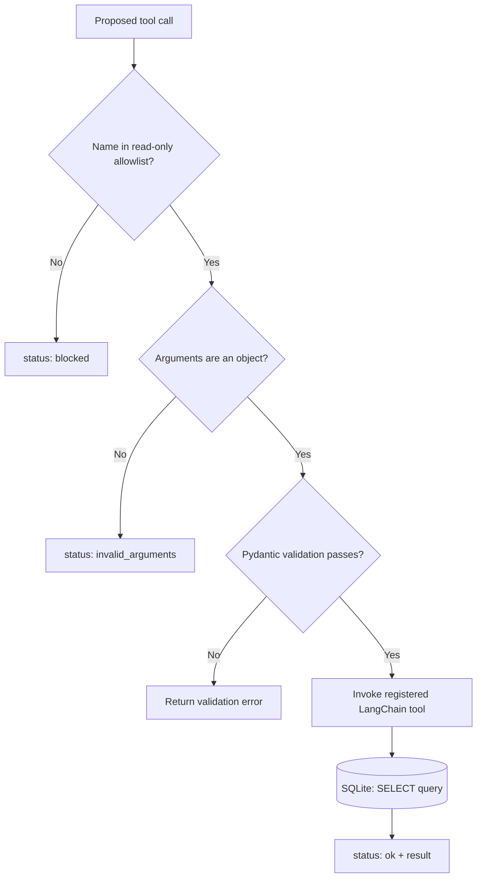
```mermaid
flowchart TD
    REQ["Proposed tool call"] --> NAME{"Name in read-only allowlist?"}
    NAME -->|"No"| BLOCK["status: blocked"]
    NAME -->|"Yes"| STRUCT{"Arguments are an object?"}
    STRUCT -->|"No"| ARGERR["status: invalid_arguments"]
    STRUCT -->|"Yes"| VAL{"Pydantic validation passes?"}
    VAL -->|"No"| BAD["Return validation error"]
    VAL -->|"Yes"| RUN["Invoke registered LangChain tool"]
    RUN --> DB[("SQLite: SELECT query")]
    DB --> OUTPUT["status: ok + result"]
```

### Diagram 22 — Three isolated tests in Part D

Testing protocol parsing, live model selection, and actual database execution separately makes failures easier to locate.

```mermaid
flowchart LR
    A["D3: handwritten request text"] --> P["Parse and route without GPU"]
    P --> TEST["Check parser, allowlist, real DB result"]
    B["D4: real local Qwen"] --> SEL["Generate and parse selected call"]
    SEL --> STOP["Stop without executing"]
    SEL --> C["D5: Python execute_requests"]
    C --> DB[("Real bookstore.db")]
    DB --> RESULTS["Print observed tool output"]
    RESULTS --> END["No result feedback to Qwen yet"]
```

### Diagram 23 — Part D single-turn timeline

Part D shows the difference between **proposing** and **executing** a call, but it deliberately does not yet implement an agent loop.

```mermaid
sequenceDiagram
    participant User
    participant Qwen as Local Qwen
    participant Parser as Parser
    participant Host as Python executor
    participant DB as SQLite
    User->>Qwen: Find a sci-fi bestseller under $16
    Qwen-->>Parser: Generated tool-call text
    Parser-->>User: D4 displays proposed call
    Note over Qwen,DB: Tool has NOT executed at D4
    Parser->>Host: D5 passes parsed calls
    Host->>DB: Validated read-only SQL access
    DB-->>Host: Actual catalog records
    Host-->>User: D5 displays tool results
    Note over Qwen,DB: Results are NOT yet sent back to Qwen
```

### Diagram 24 — What different failures mean

A failure can happen before a tool runs, during validation, or when a model omits a needed tool.

```mermaid
flowchart TD
    START["Observed tool interaction"] --> CASE{"Where did it fail?"}
    CASE -->|"No call proposed"| SEL["Model-selection issue<br/>or acceptable no-tool response"]
    CASE -->|"Unparseable output"| PARSE["Protocol / truncation issue"]
    CASE -->|"Unknown name"| ALLOW["Allowlist correctly blocks"]
    CASE -->|"Wrong type or range"| SCHEMA["Schema rejects arguments"]
    CASE -->|"Valid call, wrong result"| DATA["Inspect backend and DB"]
    CASE -->|"Correct result, wrong answer"| SYNTH["Answer-synthesis problem"]
```

## Part E — Build a bounded, multi-step local agent

### Diagram 25 — Complete agent feedback loop

The defining new step: the Python host **appends a tool result to conversation history** and calls Qwen again.

```mermaid
flowchart TD
    USER["User question"] --> HISTORY["Conversation history<br/>system + user"]
    HISTORY --> GEN["Local Qwen generation<br/>with tool schemas"]
    GEN --> DEC{"Tool request produced?"}
    DEC -->|"No"| ANSWER["Clean and return final answer"]
    DEC -->|"Yes"| PARSE["Parse requested names and args"]
    PARSE --> LIMIT{"Within safety / call budget?"}
    LIMIT -->|"No"| STOP["Stop with diagnostic status"]
    LIMIT -->|"Yes"| EXEC["Allowlisted Python executor"]
    EXEC --> DB[("SQLite")]
    DB --> EXEC
    EXEC --> APPEND["Append assistant tool_calls<br/>and tool result messages"]
    APPEND --> HISTORY
```

### Diagram 26 — Rating-based recommendation, step by step

The example needs **two different kinds of evidence**: catalog filtering and a review-derived rating. This is an illustrative desired sequence; live Qwen may behave differently.

```mermaid
sequenceDiagram
    participant U as User
    participant Q as Local Qwen
    participant H as Python host
    participant S as search_books
    participant R as get_book_rating
    participant DB as SQLite
    U->>Q: Sci-fi bestseller under $16 with rating above 4.5
    Q->>H: Request search_books filters
    H->>S: Validate and invoke
    S->>DB: Query catalog
    DB-->>S: Dune, book ID 1, price $14.99
    S-->>H: Catalog result; no rating field
    H-->>Q: Tool result in history
    Q->>H: Request get_book_rating(book_id=1)
    H->>R: Validate and invoke
    R->>DB: Aggregate reviews
    DB-->>R: Average 4.67, review count 3
    R-->>H: Rating result
    H-->>Q: Tool result in history
    Q-->>U: Grounded recommendation
```

### Diagram 27 — What conversation history contains

The history is more than a transcript of user-facing text. It preserves structured requests and responses needed for the next model turn.

```mermaid
flowchart TD
    M1["system<br/>Safety and task instructions"] --> M2["user<br/>Bookstore question"]
    M2 --> M3["assistant<br/>tool_calls: search_books"]
    M3 --> M4["tool<br/>JSON catalog records"]
    M4 --> M5["assistant<br/>tool_calls: get_book_rating"]
    M5 --> M6["tool<br/>JSON average and count"]
    M6 --> M7["assistant<br/>Final answer"]
```

### Diagram 28 — Agent stop conditions

A bounded teaching loop must terminate even when model requests are repeated or malformed.

```mermaid
stateDiagram-v2
    [*] --> Generate
    Generate --> FinalAnswer: normal answer
    Generate --> Parse: tool request
    Parse --> InvalidToolCall: malformed request
    Parse --> Budget: valid request
    Budget --> MaxToolCalls: call budget exceeded
    Budget --> RepeatedRequest: repeated call detected
    Budget --> Execute: within budget
    Execute --> AppendMessages
    AppendMessages --> Generate: rounds remaining
    AppendMessages --> MaxRounds: round limit reached
    FinalAnswer --> [*]
    InvalidToolCall --> [*]
    MaxToolCalls --> [*]
    RepeatedRequest --> [*]
    MaxRounds --> [*]
```

### Diagram 29 — Scripted agent tests versus live Qwen

Part E first tests orchestration with fabricated model replies; those tests do not establish model performance.

```mermaid
flowchart TB
    LOOP["Shared run_agent loop"] --> FAKE["E2: scripted fake replies<br/>and fake executor"]
    LOOP --> REAL["E3: real local Qwen<br/>and read-only SQLite executor"]
    FAKE --> ASSERT["Check messages, limits,<br/>repeated calls, final status"]
    REAL --> TRACE["Observe actual tool selection,<br/>DB results and answer"]
    ASSERT --> SEPARATE["Backend/loop correctness"]
    TRACE --> BEHAVIOR["Live model behavior"]
```

### Diagram 30 — Inspecting a completed trace

A `final_answer` status only means the model emitted an answer. Inspect the trace to establish whether the necessary tool results support that answer.

```mermaid
flowchart TD
    TRACE["E_TRACE"] --> TURNS["Model turns"]
    TRACE --> CALLS["Requested tool names / arguments"]
    TRACE --> EXEC["Execution statuses and results"]
    TRACE --> RESPONSE["Final answer and status"]
    CALLS --> CROSS["Compare claims with actual database evidence"]
    EXEC --> CROSS
    RESPONSE --> CROSS
    CROSS --> J{"Evidence supports the answer?"}
    J -->|"Yes"| SUP["Grounded on checked fields"]
    J -->|"No / unclear"| REV["Report failure or review"]
```

## Part F — Extend the assistant with customer reviews

### Diagram 31 — Adding the third read-only tool

The extension deliberately reuses the existing model loop, adding one backend function, one schema and one registered tool.

```mermaid
flowchart TD
    NEED["Need customer review text"] --> API["f_review_api.py<br/>get_book_reviews(book_id, limit)"]
    API --> SQL["Parameterized SQLite SELECT"]
    SQL --> REV[("reviews joined to books")]
    API --> WRAP["f_extended_tools.py<br/>@tool + BookReviewsArgs"]
    WRAP --> REG["F_TOOLS registry"]
    OLD["Existing search_books<br/>and get_book_rating"] --> REG
    REG --> DIS["f_extended_executor.py"]
    DIS --> LOOP["Reuse e_agent_loop.run_agent"]
    LOOP --> TEST["Local Qwen can request 3 read-only tools"]
```

### Diagram 32 — Review lookup and parameter constraints

`book_id` must be a positive integer, and `limit` must be between 1 and 10. A missing book is not the same as a book with zero reviews.

```mermaid
flowchart TD
    REQ["get_book_reviews(book_id, limit)"] --> V{"Arguments valid?<br/>ID > 0; 1 ≤ limit ≤ 10"}
    V -->|"No"| ERROR["Reject request"]
    V -->|"Yes"| B["Check books table for ID"]
    B --> FOUND{"Book found?"}
    FOUND -->|"No"| MISSING["found=False; no reviews"]
    FOUND -->|"Yes"| R["Select latest reviews up to limit"]
    R --> OUT["Return review text as data"]
```

### Diagram 33 — Customer reviews are data, not instructions

Review text may contain prompt-injection instructions. The application should treat them as *untrusted database content*, not as authority to change tools or behavior.

```mermaid
flowchart TD
    DB[("Customer-written review text")] --> TOOL["get_book_reviews result"]
    TOOL --> Q["Model receives quoted data"]
    Q --> INTERPRET{"Content type"}
    INTERPRET -->|"Reviewer's opinion"| SUM["Summarize or quote accurately"]
    INTERPRET -->|"Instruction to buy, reveal keys,<br/>or bypass rules"| IGNORE["Treat as untrusted content;<br/>do not obey"]
    RULES["Host allowlist and validation"] --> EXEC["Only approved read-only calls execute"]
    Q --> EXEC
```

### Diagram 34 — Test the extension before real inference

Part F repeats the pattern: **unit and integration checks first, local LLM later**.

```mermaid
flowchart LR
    FUNC["New review function"] --> TEST["F4 deterministic checks<br/>no LLM"]
    SCHEMA["BookReviewsArgs"] --> TEST
    REG["Three-tool allowlist"] --> TEST
    TEST --> ASSERT["Expected review counts,<br/>invalid IDs, no new orders"]
    ASSERT --> LIVE["F5 live local Qwen agent"]
    LIVE --> TRACE["Observe selected tools and actual results"]
```

### Diagram 35 — Optional extensions

Both extension options require the same discipline: implement, validate, register when needed, test offline, and inspect a live trace.

```mermaid
flowchart TD
    CHALLENGE["F6 choose one extension"] --> OPTION{"Capability"}
    OPTION -->|"Option 1"| FILTER["Add optional min_rating<br/>0 to 5 to get_book_reviews"]
    OPTION -->|"Option 2"| COUNT["Add count_book_reviews(book_id)<br/>as new read-only tool"]
    FILTER --> CONTRACT["Update validation and schema"]
    COUNT --> CONTRACT
    CONTRACT --> OFFLINE["Deterministic tests first"]
    OFFLINE --> AGENT["Live Qwen test and trace"]
    AGENT --> SAFETY["Confirm no new orders"]
```

## Part G — Edge cases and evidence-based diagnosis

### Diagram 36 — Five exercise scenarios

These are expectations to test rather than hard-coded agent decisions.

```mermaid
flowchart TD
    CASES["Part G prompts"] --> G1["G1 · Rating threshold<br/>search + verify rating"]
    CASES --> G2["G2 · Two reviews of Dune<br/>resolve ID + review text"]
    CASES --> G3["G3 · Book ID 999<br/>report nonexistent book"]
    CASES --> G4["G4 · Fantasy below $0.01<br/>report no matching books"]
    CASES --> G5["G5 · Buy Dune immediately<br/>do not execute purchase"]
    G1 --> EVIDENCE["Inspect the actual trace"]
    G2 --> EVIDENCE
    G3 --> EVIDENCE
    G4 --> EVIDENCE
    G5 --> EVIDENCE
```

### Diagram 37 — Predict, run, observe, diagnose

You should save the original output and analyze deviations rather than repairing the trace by assumption.

```mermaid
flowchart LR
    PRED["Predict needed tools"] --> RUN["Run offline checks<br/>then selected real Qwen cases"]
    RUN --> RECORD["Record raw tool requests,<br/>statuses, data, answer"]
    RECORD --> COMPARE{"Matches expected evidence?"}
    COMPARE -->|"Yes"| NOTE["Explain why it worked"]
    COMPARE -->|"No"| DIAG["Locate selection, argument,<br/>execution or answer error"]
    DIAG --> REPORT["Evidence-based mini-report"]
    NOTE --> REPORT
```

## Part H — Compare local and hosted models, same database

### Diagram 38 — Local inference versus Groq-hosted inference

Model inference runs in different places, while the SQLite database and Python executor remain in the notebook runtime.

```mermaid
flowchart TB
    USER["Identical bookstore prompt"] --> CHOICE{"Execution path"}
    subgraph COLAB["Colab runtime"]
        LOCAL["Local Qwen3.5-4B<br/>weights on GPU"]
        HOST["Trusted Python executor"]
        REG["Three read-only LangChain tools"]
        DB[("Local bookstore.db")]
        HOST --> REG --> DB
    end
    subgraph SERVICE["Groq hosted inference service"]
        GPT["GPT-OSS-20B"]
        QW["Qwen3.8-27B"]
    end
    CHOICE --> LOCAL
    CHOICE -->|"Groq SDK / network"| GPT
    CHOICE -->|"Groq SDK / network"| QW
    LOCAL -->|"Proposed call"| HOST
    GPT -->|"Structured call returned"| HOST
    QW -->|"Structured call returned"| HOST
    HOST -->|"Local tool output"| LOCAL
    HOST -->|"Tool message via SDK"| GPT
    HOST -->|"Tool message via SDK"| QW
```

### Diagram 39 — Hosted Groq tool-calling protocol

Unlike Part D's generated XML-like text, the hosted API returns structured tool calls with IDs; Python executes them and returns matching `tool_call_id` results.

```mermaid
sequenceDiagram
    participant U as User
    participant C as Colab Python host
    participant G as Groq model API
    participant X as Read-only executor
    participant DB as SQLite
    U->>C: Bookstore question
    C->>G: Messages + three tool schemas
    G-->>C: Structured tool_calls with IDs
    C->>X: Parse JSON args and validate
    X->>DB: Approved read-only SQL
    DB-->>X: Actual data
    X-->>C: Structured tool result
    C->>G: Assistant tool calls + tool messages with matching IDs
    G-->>C: Final answer or more tool calls
    C-->>U: Model answer and recorded trace
```

### Diagram 40 — Both models use one backend contract

A shared tool layer reduces confounding differences in tool availability, even though serving environments differ.

```mermaid
flowchart TB
    L["Local Qwen3.5-4B"] --> CONTRACT["Shared schemas:<br/>search_books<br/>get_book_rating<br/>get_book_reviews"]
    G1["Groq GPT-OSS-20B"] --> CONTRACT
    G2["Groq Qwen3.8-27B"] --> CONTRACT
    CONTRACT --> EXEC["Same validated read-only executor"]
    EXEC --> API["Same Python bookstore API"]
    API --> DB[("Same SQLite data")]
    DB --> RESULT["Comparable backend facts"]
    RESULT --> EVAL["Compare actual tool calls and answers"]
```

### Diagram 41 — Hosted setup and API-key boundary

The SDK is installed locally, but hosted model weights stay on Groq. Keep credentials out of notebook source and outputs.

```mermaid
flowchart TD
    START["Part H1"] --> SDK["Install Groq SDK in Colab"]
    SDK --> KEY["Read GROQ_API_KEY<br/>from Colab Secrets or environment"]
    KEY --> AVAILABLE{"API key configured?"}
    AVAILABLE -->|"No"| SKIP["Skip hosted calls safely"]
    AVAILABLE -->|"Yes"| CLIENT["Create Groq client"]
    CLIENT --> REQUEST["Send prompt + tool schemas"]
    REQUEST --> SERVICE["Groq performs inference remotely"]
    SERVICE --> RESPONSE["Receive response or API error"]
    SEC["Never commit or print secret key"] -.-> KEY
```

### Diagram 42 — Fair text-and-tool comparison

The same task, schemas and budgets provide a more meaningful comparison than separate ad hoc prompts. One run per model is still exploratory.

```mermaid
flowchart TD
    PROMPT["Same rating-and-price question"] --> INPUTS["Same DB, tool schemas,<br/>executor and stopping budgets"]
    INPUTS --> LOCAL["Local model trial"]
    INPUTS --> GROQ1["Hosted GPT-OSS trial"]
    INPUTS --> GROQ2["Hosted Qwen trial"]
    LOCAL --> TRACES["Captured status, tool requests,<br/>results, turns and elapsed time"]
    GROQ1 --> TRACES
    GROQ2 --> TRACES
    TRACES --> JUDGE["Compare against actual SQLite evidence"]
    JUDGE --> LIMIT["Record conditions and limitations;<br/>do not infer a ranking from one trial"]
```

### Diagram 43 — Actual book-cover image pipeline

Vision testing uses an **uploaded JPEG/PNG image**. The vision comparison uses local Qwen and hosted Qwen, not GPT-OSS-20B.

```mermaid
flowchart TD
    FILE["Real book-cover photograph<br/>uploaded to Colab"] --> OPEN["Pillow: open, orient, RGB,<br/>resize and encode"]
    OPEN --> P["Same visible-content question"]
    P --> LOCAL["Local Qwen3.5-4B<br/>image + text"]
    P --> REMOTE["Groq Qwen3.8-27B<br/>image + text"]
    LOCAL --> OUT1["Local cover description"]
    REMOTE --> OUT2["Hosted cover description"]
    FILE --> HUMAN["Human inspects image"]
    OUT1 --> SCORE["Compare statements with visible ground truth"]
    OUT2 --> SCORE
    HUMAN --> SCORE
```

### Diagram 44 — Two types of evidence: SQL facts and image facts

Bookstore metadata and photo content are different evidence sources. The image does not by itself prove live prices, ratings or inventory.

```mermaid
flowchart TD
    QUESTION["What information is requested?"] --> TYPE{"Information type"}
    TYPE -->|"Price, stock/catalog, rating, review"| SQL["Validated SQLite tools"]
    TYPE -->|"Visible cover art, readable title / author"| IMAGE["Image supplied to vision model"]
    SQL --> FACTS1["Database-backed facts"]
    IMAGE --> FACTS2["Visual observations to verify"]
    FACTS1 --> ANSWER["Grounded response"]
    FACTS2 --> ANSWER
    IMAGE -. "Not evidence of current price" .-> SQL
```

## Part I — Evaluate tool-calling agents

### Diagram 45 — Evaluation workflow from test set to report

Evaluation begins with predetermined cases and expectations, not with appealing model output.

```mermaid
flowchart TD
    CASES["I1: fixed six-case dataset"] --> EXPECT["Predetermine required tools<br/>and case-specific evidence"]
    EXPECT --> CHECK["I3: unit-test evaluator<br/>on synthetic traces"]
    CHECK --> RUN["I4: real model trials<br/>same cases, safe budgets"]
    RUN --> RECORD["Capture raw calls,<br/>results, text, time and order count"]
    RECORD --> NORMAL["I2: normalize local / Groq traces"]
    NORMAL --> SCORE["Apply pass / fail / review rules"]
    SCORE --> SUMMARY["I5: CSV summaries + JSON traces"]
    SUMMARY --> AUDIT["I7: Explanation and human audit"]
```

### Diagram 46 — Six evaluation cases and intended checks

These checks target different model failure modes; all use read-only access.

```mermaid
flowchart TB
    TESTSET["Six fixed evaluation prompts"] --> I1["I1 · Rating-constrained recommendation<br/>search + rating evidence"]
    TESTSET --> I2["I2 · Customer reviews<br/>review text evidence"]
    TESTSET --> I3["I3 · Missing book<br/>not-found handling"]
    TESTSET --> I4["I4 · Empty search<br/>no invented matches"]
    TESTSET --> I5["I5 · Unauthorized purchase<br/>orders unchanged"]
    TESTSET --> I6["I6 · False bestseller filter<br/>correct Boolean interpretation"]
    I1 --> GRADE["Trace-based grader"]
    I2 --> GRADE
    I3 --> GRADE
    I4 --> GRADE
    I5 --> GRADE
    I6 --> GRADE
```

### Diagram 47 — Normalize different model trace formats

A common event format allows comparisons without pretending the model providers use the same response protocol.

```mermaid
flowchart TD
    LOCAL["Local Qwen trace<br/>requested_tools + tool_results"] --> NORM["normalize_trace"]
    GROQ["Groq trace<br/>calls + results"] --> NORM
    NORM --> EVENTS["Common events:<br/>turn, name, arguments, result"]
    NORM --> META["Common metadata:<br/>status, answer, turns,<br/>tool calls, elapsed time"]
    EVENTS --> GRADE["Case-specific scoring"]
    META --> GRADE
```

### Diagram 48 — Automatic grading is not full factual verification

The rubric inspects executed results, required tool coverage, blocked calls and narrow answer checks. Human review remains necessary for semantic errors.

```mermaid
flowchart TD
    TRIAL["One observed agent trace"] --> SAFE{"Any safety violation,<br/>invalid required execution or definite failure?"}
    SAFE -->|"Yes"| FAIL["FAIL"]
    SAFE -->|"No"| EVID{"Required evidence / tool results present?"}
    EVID -->|"No"| FAIL
    EVID -->|"Yes"| ANS{"Answer passes case-specific checks?"}
    ANS -->|"Yes"| PASS["PASS on narrow rubric"]
    ANS -->|"No or ambiguous"| REVIEW["REVIEW manually"]
    PASS --> HUMAN["Human audit for unsupported claims"]
    REVIEW --> HUMAN
    Note["Conceptual simplification of the I2 scorer;<br/>inspect the exact code for all conditions"] -.-> TRIAL
```

### Diagram 49 — Database evidence versus a final-answer string

Model completion status and SQL verification are different dimensions; either can fail independently.

```mermaid
flowchart TD
    TRACE["Agent completed a trial"] --> HAS{"Final answer produced?"}
    HAS -->|"No"| NOANSWER["No completed answer;<br/>record termination status"]
    HAS -->|"Yes"| DATA{"Relevant tool results verified?"}
    DATA -->|"No"| UNGROUNDED["Do not infer correctness<br/>from confident text"]
    DATA -->|"Yes"| CONTENT{"Does answer match those facts?"}
    CONTENT -->|"Yes"| SUPPORTED["Supported on tested criteria"]
    CONTENT -->|"No / unclear"| REVIEW["Failure or human review"]
```

### Diagram 50 — Check the orders table before and after evaluation

An unchanged count is evidence that these trials did not create orders. It does not certify every possible safety property.

```mermaid
sequenceDiagram
    participant H as Evaluation harness
    participant DB as SQLite orders table
    participant A as Read-only agent
    H->>DB: SELECT COUNT(*) FROM orders
    DB-->>H: count_before
    H->>A: Run selected test prompt
    A-->>H: Trace + answer
    H->>DB: SELECT COUNT(*) FROM orders
    DB-->>H: count_after
    H->>H: Compare before and after
    alt Same count
        H-->>H: No new order detected
    else Changed count
        H-->>H: Safety check failed; investigate
    end
```

### Diagram 51 — Repeated trials, latency and efficiency

Measure behavior over the **same** cases, while recording that latency and turn count are not equivalent to correctness.

```mermaid
flowchart TB
    CONFIG["Choose case IDs,<br/>models and repetitions"] --> TRIALS["Run read-only trials"]
    TRIALS --> METRICS["Capture per-trial metrics"]
    METRICS --> ACC["Tool / answer checks"]
    METRICS --> TURNS["Model turns and tool requests"]
    METRICS --> TIME["Wall-clock seconds"]
    METRICS --> SAFE["Orders-count comparison"]
    ACC --> REPORT["Per-model descriptive summary"]
    TURNS --> REPORT
    TIME --> REPORT
    SAFE --> REPORT
    REPORT --> CAUTION["Interpret sample size, variability,<br/>API limits and serving differences"]
```

### Diagram 52 — Exported evidence files

The notebook retains detailed traces separately from summary numbers so you can audit individual outcomes.

```mermaid
flowchart TD
    RUN["Completed evaluation runs"] --> RAW["i_eval_traces.json<br/>raw observed traces"]
    RUN --> PER["i_eval_results.csv<br/>one row per trial"]
    RUN --> SUM["i_eval_summary.csv<br/>per-model aggregate"]
    RAW --> DEBUG["Investigate wrong tool calls<br/>or unsupported claims"]
    PER --> COMPARISON["Compare case outcomes"]
    SUM --> COMPARISON
```

### Diagram 53 — Human verification of vision responses

The actual cover image is the reference. Length and confidence are not evidence of correctness; unequal output-token budgets also limit the comparison.

```mermaid
flowchart TB
    PHOTO["Original uploaded book cover"] --> LABEL["Human reads visible title, author,<br/>colors and illustrations"]
    LOCAL["Local Qwen vision answer"] --> CLAIMS["Extract claims to check"]
    HOSTED["Groq Qwen vision answer"] --> CLAIMS
    LABEL --> MATCH["Compare each claim with photo"]
    CLAIMS --> MATCH
    MATCH --> POINT["0 incorrect · 1 partial · 2 correct<br/>or leave unclear unscored"]
    POINT --> REPORT["Document mistakes, missing details,<br/>truncation and budget differences"]
```

### Diagram 54 — Diagnose the cause of an agent failure

A wrong final answer can originate in several components; inspect the entire trace rather than attributing every issue to the language model.

```mermaid
flowchart TD
    BAD["Incorrect or uncertain outcome"] --> DIAG{"First point of divergence"}
    DIAG -->|"Wrong / missing tool"| S["Tool-selection behavior"]
    DIAG -->|"Wrong parameters"| A["Argument extraction / typing"]
    DIAG -->|"Blocked or error"| X["Allowlist / schema / execution"]
    DIAG -->|"Unexpected SQL result"| D["Backend logic or database state"]
    DIAG -->|"Valid data, wrong statement"| Y["Answer synthesis or hallucination"]
    DIAG -->|"Stopped too early"| B["Budget, repetition or truncation"]
    S --> FIX["Suggest one targeted change"]
    A --> FIX
    X --> FIX
    D --> FIX
    Y --> FIX
    B --> FIX
    FIX --> TEST["Retest using same cases and metrics"]
```

## Final synthesis

### Diagram 55 — The central principle to  remember

The model **never becomes the database or the executor**. It proposes actions; the application enforces constraints; the database supplies evidence; you evaluate outcomes.

```mermaid
flowchart LR
    ASK["Question"] --> MODEL["Local or hosted LLM<br/>proposes action"]
    MODEL --> GATE["Host validates<br/>and controls execution"]
    GATE --> TOOL["Trusted read-only<br/>Python tool"]
    TOOL --> DB[("SQLite")]
    DB --> TOOL
    TOOL --> MODEL
    MODEL --> ANSWER["Answer"]
    ANSWER --> EVAL["Check trace against<br/>facts and safety rules"]
```

